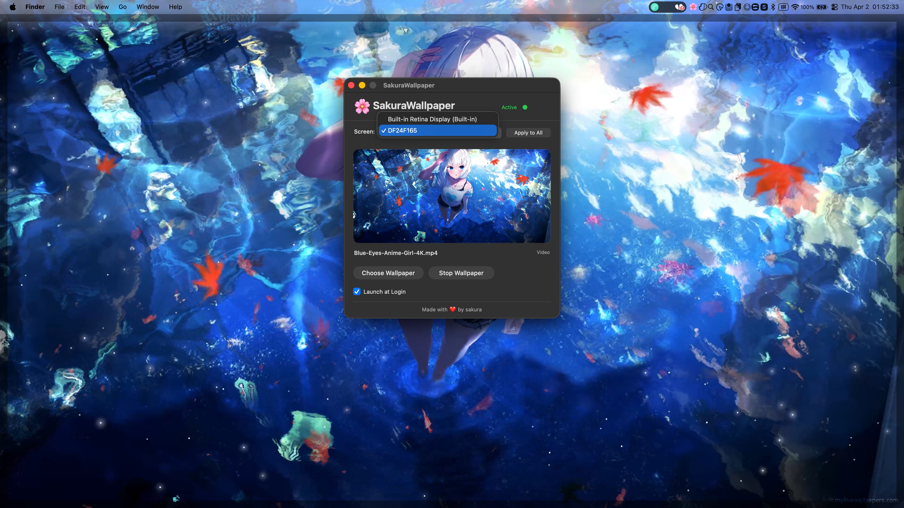

# macOS video wallpaper app built with Swift
# SakuraWallpaper

A lightweight video and image wallpaper application for macOS.

[Chinese Documentation](README_CN.md)

## Features

- Set videos (MP4, MOV, GIF) or images (PNG, JPG, HEIC, WebP) as desktop wallpaper
- **Rotation Mode**: Select a folder to automatically cycle through wallpapers
- **Playlist Previews**: Interactive grid view with live previews of the currently selected item
- **Shuffle Mode**: Randomize wallpaper rotation order
- **Battery Saver**: Automatically pauses wallpaper playback when battery level is at or below 20% and not charging
- Multi-display support with independent wallpaper per screen
- Video wallpaper with automatic loop playback
- Recent wallpapers history for quick switching (Supports folders)
- Launch at login support
- Manual Pause/Resume control
- Bilingual interface (English / Chinese)

## Screenshots





## Supported Formats

**Video**
- MP4, MOV, M4V
- GIF (animated)

**Image**
- PNG, JPG, JPEG
- HEIC
- WebP, BMP, TIFF

## Installation

### Download

Download the latest `SakuraWallpaper.dmg` from [Releases](../../releases) and drag SakuraWallpaper to Applications folder.
OR
```
brew install --cask yueseqaz/tap/sakura-wallpaper
```

### Build from Source

```
git clone https://github.com/yueseqaz/SakuraWallpaper.git
cd SakuraWallpaper
./build.sh
open build/SakuraWallpaper.app
```

Requirements: macOS 12.0+, Xcode Command Line Tools

## Usage

1. Click **Pick File** to set a single wallpaper, or **Pick Folder** to enable rotation mode
2. Use the **Interval** stepper to set how often the wallpaper changes (in Rotation Mode)
3. Enable **Shuffle** for randomized order
4. Toggle **Battery Saver** to optimize energy usage while working in other apps or when the screen is off
5. Use the screen dropdown to switch between displays (or **All Screens** for global control)
6. Click **Sync All Screens** to push your current selection to every monitor
7. Click **Clear** to remove wallpaper from the selected screen
8. Right-click the status bar icon for quick controls

### Status Bar Menu

- **Open SakuraWallpaper** - Open main window
- **Status: Live/Paused/None** - Real-time informational readout
- **Pause Playback** - Manual toggle for all wallpapers
- **Battery Saver** - Pause automatically when battery is low (<=20%) and not charging
- **Next Wallpaper** (Shortcut: `n`) - Skip to the next item in the rotation
- **Clear Wallpaper** - Reset and remove current selection
- **Per-Screen Pause** - Pause/resume individual screens
- **Recent** - Quick switch to previous wallpapers or folders
- **Language** - Switch between English and Chinese
- **Clear History** - Clear wallpaper history

## Fix "App is Damaged" Error

If you see "SakuraWallpaper is damaged and can't be opened", run this command in Terminal:

```
xattr -cr /Applications/SakuraWallpaper.app
```

This removes the quarantine attribute that macOS applies to apps downloaded from the internet.

## System Requirements

- macOS 12.0 Monterey or later
- Supports multiple displays

## Project Structure

```
SakuraWallpaper/
├── AppDelegate.swift          # App lifecycle and status bar
├── MainWindowController.swift # Main window UI
├── WallpaperManager.swift     # Wallpaper playback engine
├── ScreenPlayer.swift         # Individual screen player
├── SettingsManager.swift      # User preferences storage
├── Localization.swift         # Localization helper
├── MediaType.swift            # File type detection
├── ThumbnailItem.swift        # Collection view item for previews
├── AboutWindowController.swift # About window
├── main.swift                 # Entry point
├── build.sh                   # Build script
├── AppIcon.icns               # App icon
├── Resources/
│   ├── en.lproj/              # English strings
│   └── zh-Hans.lproj/         # Chinese strings
├── README.md                  # English documentation
├── README_CN.md               # Chinese documentation
├── LICENSE                    # MIT License
└── .gitignore                 # Git ignore rules
```

## Contributing

Contributions are welcome. Please open an issue or submit a pull request.

## License

MIT License - see [LICENSE](LICENSE) for details.

## Acknowledgments

Made with ❤️ by sakura
